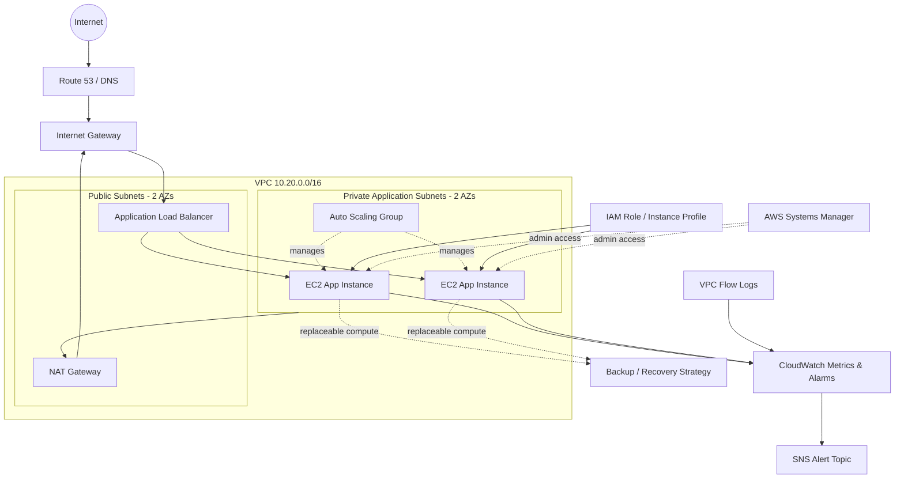

# Architecture Diagram

## Trust Boundaries

- Internet-facing: Route 53 / ALB
- Public network tier: ALB + NAT
- Private workload tier: EC2 Auto Scaling Group
- Management plane: IAM / SSM
- Observability plane: CloudWatch / Flow Logs / SNS
